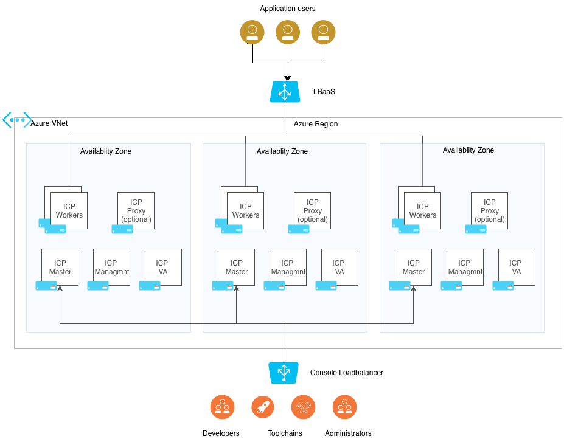

# Deploying IBM Cloud Private Enterprise Edition on Azure using Terraform

This template deploys ICP Enterprise Edition across three Azure Availability Zones.


Limitations
- Since Azure Cloud Provider for Kubernetes 1.11 is not Zone aware, so you should not use Dynamic Volume Provisioning with a multi-zone setup.

## Infrastructure Architecture
The following diagram outlines the infrastructure architecture.


## Resources created by this template
|Resource type            | Resources      |
|----------------|-----------------------------|
| azurerm_resource_group | 1 new resource group for ICP cluster |
| azurerm_virtual_network | 1 new virtual network for ICP cluster |
| azurerm_route_table | 1 new route table |
| azurerm_subnet | <ul><li>1 subnet for cluster VMs<li>1 subnet for container network</ul> |
| azurerm_public_ip | <ul><li>bootnode pip<li>master pip</ul> |
| azurerm_network_interface | <ul><li>boot nic<li>master nic<li>proxy nic<li>management nic<li>worker nic</ul> |
| azurerm_network_security_group | <ul><li>boot_sg<li>master_sg<li>proxy_sg<li>worker_sg</ul> |
| azurerm_lb | <ul><li>Single Standard SKU LoadBalancer</ul>
| azurerm_lb_rule | <ul><li>master_rule<li>proxy_rule</ul> |
| azurerm_lb_backend_address_pool | <ul><li>masterlb_pool<li>proxylb_pool</ul>
| azurerm_network_interface_backend_address_pool_association | <ul><li>masterlb<li>proxylb</ul> |
| azurerm_virtual_machine | <ul><li>boot<li>master<li>proxy<li>management<li>worker</ul> |


## Using the Terraform templates

1. git clone the repository

2. Create a [terraform.tfvars](https://www.terraform.io/intro/getting-started/variables.html#from-a-file) file to reflect your environment. Please see [variables.tf](variables.tf) and below tables for variable names and descriptions.

| variable           | default       |required| description                            |
|--------------------|---------------|--------|----------------------------------------|
| **Azure account options** | | |
|resource_group      |icp_rg         |No      |Azure resource group name               |
|location            |West Europe    |No      |Region to deploy to                     |
|storage_account_tier|Standard       |No      |Defines the Tier of storage account to be created. Valid options are Standard and Premium.|
|storage_replication_type|LRS            |No      |Defines the Replication Type to use for this storage account. Valid options include LRS, GRS etc.|
|default_tags        |{u'Owner': u'icpuser', u'Environment': u'icp-test'}|No      |Map of default tags to be assign to any resource that supports it|
| **ICP Virtual machine settings** | | |
|master |{'vm_size':'Standard_A8_v2'<br>'nodes':3<br>'name':'master'}|No | Master node instance configuration |
|management|{'vm_size':'Standard_A8_v2'<br>'nodes':3<br>'name':'mgmt'}|No | Management node instance configuration|
|proxy|{'vm_size':'Standard_A2_v2'<br>'nodes':3<br>'name':'proxy'}|No| Proxy node instance configuration |
|worker |{'vm_size':'Standard_A4_v2'<br>'nodes':6<br>'name':'worker'}|No| Worker node instance configuration |
|os_image            |ubuntu         |No      |Select from Ubuntu (ubuntu) or RHEL (rhel) for the Operating System|
|admin_username      |vmadmin        |No      |linux vm administrator user name        |
| **Azure network settings**| | |
|virtual_network_name|icp_vnet           |No      |The name for the virtual network.       |
|route_table_name    |icp_route      |No      |The name for the route table.           |
| **ICP Settings** | | | |
|cluster_name        |myicp          |No      |Deployment name for resources prefix    |
|ssh_public_key      |               |No      |SSH Public Key to add to authorized_key for admin_username. Required if you disable password authentication |
|disable_password_authentication|true           |No      |Whether to enable or disable ssh password authentication for the created Azure VMs. Default: true|
|icp_version         |3.1.1         |No      |ICP Version                             |
|cluster_ip_range    |10.1.0.0/24    |No      |ICP Service Cluster IP Range            |
|network_cidr        |10.0.128.0/17    |No      |ICP Network CIDR                        |
|instance_name       |icp            |No      |Name of the deployment. Will be added to virtual machine names|
|icpadmin_password   |admin          |No      |ICP admin password                      |


### Notes on Azure Cloud Provider for Kubernetes

#### Availability Zones
Kubernetes adds support for Azure Availability Zones in version 1.12, as an alpha feature.
Read more about it [here](https://github.com/kubernetes/cloud-provider-azure/blob/master/docs/using-availability-zones.md)
ICP 3.1.1 includes Kubernetes 1.11 in which the Azure Cloud Provider is not Zone aware. This means that features such as Dynamic PV provisioning should not be used with this template.

Here is an example terraform.tfvars file:

Simple terraform.tfvars to allow connectivity with existing ssh keypair.
```
ssh_public_key = "ssh-rsa AAAAB3NzaC1yc2EAAAABIwAAAQEAmGOJtZF5FYrpmEBI9GBcbcr4577pZ90lLxZ7tpvfbPmgXQVGoolChAY165frlotd+o7WORtjPiUlRnr/+676xeYCZngLh46EJislXXvcmZrIn3eeQTRdOlIkiP3V4+LiR9WvpyvmMY9jJ05sTGgk39h9LKhBs+XgU7eZMXGYNU7jDiCZssslTvV1i7SensNqy5bziQbhFKsC7TFRld9leYPgCPtoiSeFIWoXSFbQQ0Lh1ayPpOPb0C2k4tYgDFNr927cObtShUOY1dGGBZygUVKQRro1LZzq39DhmvmMCawCnnQt6A8jz4PE69jP62gnlBsdXQDvEm/L/LBrO4CBbQ=="
```

terraform.tfvars enabling SSH password authentication and provisioning 4 worker nodes
```
disable_password_authentication = false
worker = {
  "nodes" = 4
}
```

#### Using the environment

#### Logging in
When the Terraform deployment is complete, you will see an output similar to this:

```
ICP Admin Password = e66bd82cfeb5ad404ff7f62ba0ac83df
ICP Admin Username = admin
ICP Boot node = 40.67.221.37
ICP Console URL = https://icpdemo-feb5ad40.westeurope.cloudapp.azure.com:8443
ICP Kubernetes API URL = https://icpdemo-feb5ad40.westeurope.cloudapp.azure.com:8001
```

Open the Console URL in a web browser and log in with the Admin Username and Admin Password provided from the Terraform template output.


#### Using the Azure Loadbalancer

A simple test can be to create a deployment with two nginx pods that are exposed via external load balancer. To do this using kubectl follow the instructions on [IBM KnowledgeCenter Kubectl CLI](https://www.ibm.com/support/knowledgecenter/SSBS6K_3.1.0/manage_cluster/cfc_cli.html) to set up the command line client.

By default this deployment has image security enforcement enabled. You can read about Image security on [IBM KnowledgeCenter Image Security](https://www.ibm.com/support/knowledgecenter/SSBS6K_3.1.0/manage_images/image_security.html) Ensure the appropriate policies are in place.

To allow pulling nginx from Docker Hub container registry, create a file with this content:
  ```
  apiVersion: securityenforcement.admission.cloud.ibm.com/v1beta1
  kind: ImagePolicy
  metadata:
    name: allow-nginx-dockerhub
  spec:
   repositories:
   # nginx from Docker hub Container Registry
    - name: "docker.io/nginx/*"
      policy:
  ```

Then apply this policy in the namespace you're working in

  ```
  $ kubectl apply -f
  ```

Now you can deploy two replicas of an nginx pod

  ```
  kubectl run mynginx --image=nginx --replicas=2 --port=80
  ```

Finally expose this deployment

  ```
  kubectl expose deployment mynginx --port=80 --type=LoadBalancer
  ```

After a few minutes the load balancer will be available and you can see the IP address of the loadbalancer

  ```
  $ kubectl get services
  NAME         TYPE           CLUSTER-IP   EXTERNAL-IP      PORT(S)        AGE
  kubernetes   ClusterIP      10.1.0.1     <none>           443/TCP        12h
  mynginx      LoadBalancer   10.1.0.220   51.145.183.111   80:30432/TCP   2m
  ```
